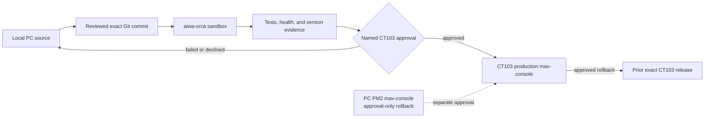

# MCC `mav-console` CT103 migration runbook

This is a source-side deployment gate, not evidence that the migration is
complete. Direct SSH, including read-only checks, is prohibited. Every remote
action uses the named Orca environment and an Orca terminal.



## Ownership and boundaries

- The local PC repository is the only source-authoring location. The release is
  the reviewed commit SHA, never an uncommitted tree or copied directory.
- `aiwa-orca` is the required sandbox for this migration. `aiwa-host` is only
  for host/LXC configuration; it does not own or operate `mav-console`.
- CT103 owns production `mav-console`. Use its paired Orca environment for
  production work, not `aiwa-host` and never a direct remote shell.
- Leave the PC PM2 `mav-console` untouched during normal migration. It remains
  an approval-only fallback, not the normal CT103 rollback path.
- The CT103 environment file is `/etc/mcc/mav-console.env`; use the tracked
  `deploy/mcc-ct103.env.example` as its nonsecret shape. Do not create or use
  `/opt/mcc/.env`.

## 1. Local review and release identity

Run locally, review the diff, and record one immutable commit before entering
an Orca environment:

```powershell
npm ci
npm run build
node --test tests/memory.test.mjs
npx vitest run tests/thumbtack-webhook.test.mjs
node -e "JSON.parse(require('node:fs').readFileSync('./ecosystem.config.linux.json', 'utf8'))"
git status --short
git rev-parse HEAD
```

Capture the exact commit SHA and the successful command output in the change
record. `git status --short` must not show release-scope changes omitted from
the reviewed commit.

## 2. Sandbox validation through `aiwa-orca`

Replace only angle-bracket placeholders. The commands below are Orca commands,
not SSH commands; read the terminal before sending work to it.

```bash
orca terminal create --environment aiwa-orca \
  --worktree <sandbox-worktree-selector> --title mcc-ct103-validate \
  --command bash --json
orca terminal read --environment aiwa-orca --terminal <sandbox-terminal-handle> --json
orca terminal send --environment aiwa-orca --terminal <sandbox-terminal-handle> \
  --text 'cd <sandbox-mcc-checkout> && git fetch origin && git checkout --detach <reviewed-commit> && test "$(git rev-parse HEAD)" = "<reviewed-commit>" && npm ci && npm run build && node --test tests/memory.test.mjs && npx vitest run tests/thumbtack-webhook.test.mjs && node -e "JSON.parse(require(\"node:fs\").readFileSync(\"./ecosystem.config.linux.json\", \"utf8\"))"' \
  --enter --json
```

In the same sandbox checkout, start an isolated test instance on `3001` only
long enough to collect health evidence; do not use this command against CT103
production:

```bash
cd <sandbox-mcc-checkout>
MCC_ENV_FILE=/etc/mcc/mav-console.env PORT=3001 node server.mjs >/tmp/mcc-ct103-sandbox.log 2>&1 &
MCC_PID=$!
trap 'kill "$MCC_PID"; wait "$MCC_PID" 2>/dev/null || true' EXIT
sleep 2
curl --fail --silent --show-error http://127.0.0.1:3001/health
curl --fail --silent --show-error http://127.0.0.1:3001/api/deploy/status
git rev-parse HEAD
node -p "require('./package.json').version"
```

Required sandbox evidence is: the recorded SHA equals `<reviewed-commit>`;
config load, build, and tests exit `0`; `/health` returns `ok`; and
`/api/deploy/status` returns `state: "ok"` with a deployment timestamp. Save
the package version beside that evidence.

## 3. Named approval, then CT103 production

Only proceed after an explicit record such as: **“Carter approves CT103
`mav-console` commit `<reviewed-commit>` after sandbox evidence `<record>`.”**
Use the CT103 paired Orca environment; `<ct103-orca-environment>` is never
`aiwa-host`.

```bash
orca terminal create --environment <ct103-orca-environment> \
  --worktree <ct103-worktree-selector> --title mcc-ct103-deploy \
  --command bash --json
orca terminal read --environment <ct103-orca-environment> --terminal <ct103-terminal-handle> --json
orca terminal send --environment <ct103-orca-environment> --terminal <ct103-terminal-handle> \
  --text 'cd <ct103-mcc-checkout> && git fetch origin && git checkout --detach <reviewed-commit> && test "$(git rev-parse HEAD)" = "<reviewed-commit>" && npm ci && npm run build && pm2 reload ecosystem.config.linux.json --only mav-console --update-env && curl --fail --silent --show-error http://127.0.0.1:3000/health && curl --fail --silent --show-error http://127.0.0.1:3000/api/deploy/status && git rev-parse HEAD && node -p "require(\"./package.json\").version"' \
  --enter --json
```

Record the CT103 commit SHA, package version, two successful endpoint responses,
and the PM2 command result. Verify the intended external MCA route separately
through its approved ingress before calling the cutover successful.

## 4. Rollback boundary

Before cutover, record `<prior-ct103-commit>` and retain its deployment
artifact. If CT103 needs rollback, obtain a named approval for that exact SHA,
then use the CT103 paired Orca environment to check out the prior exact CT103 release,
verify the SHA, run the config/build checks, reload `mav-console`, and repeat
the two endpoint checks. Do not alter the PC PM2 process as part of this normal
rollback.

The PC `mav-console` is available only after a separate explicit approval that
names it as the fallback. That approval is distinct from the CT103 rollback
approval and must preserve a path to return to the recorded CT103 release.
