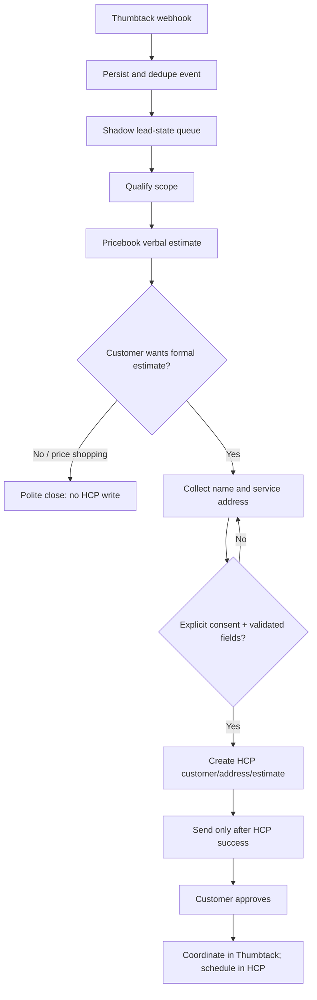

# Thumbtack → Maverick lead flow

Maverick must never create an HCP record or estimate merely because a Thumbtack lead exists. The webhook queue is idempotent, customer messages are independently gated, and HCP writes require explicit customer intent plus complete identity and service address.

## Activation gates

Outbound Thumbtack replies require both `THUMBTACK_AUTO_REPLY_ENABLED=true` and `THUMBTACK_NATIVE_AUTO_REPLY_DISABLED=true`. HCP writes are a third, separate gate: `THUMBTACK_HCP_WRITES_ENABLED=true`. Until all required gates are enabled and the lead-state processor is reviewed, incoming events remain in shadow mode and no customer-facing message or HCP write occurs.
